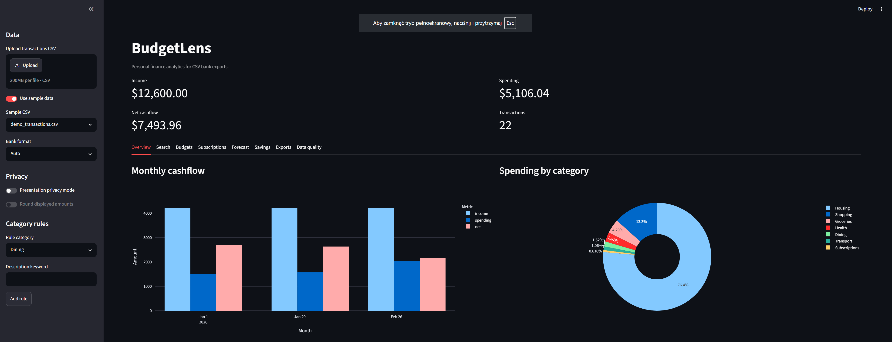
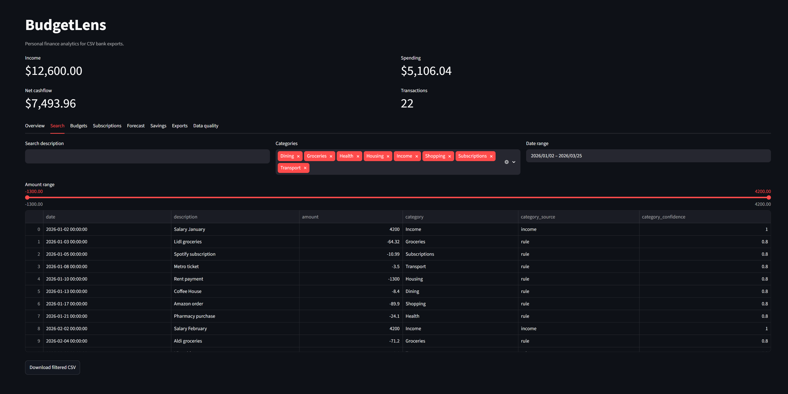
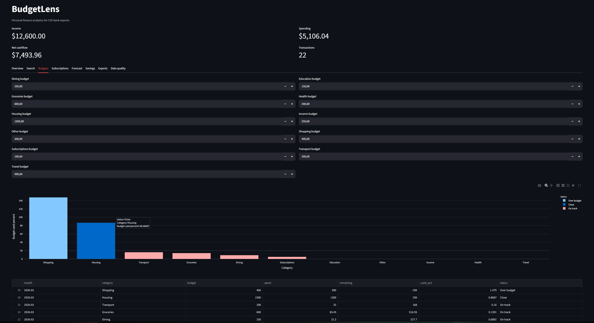
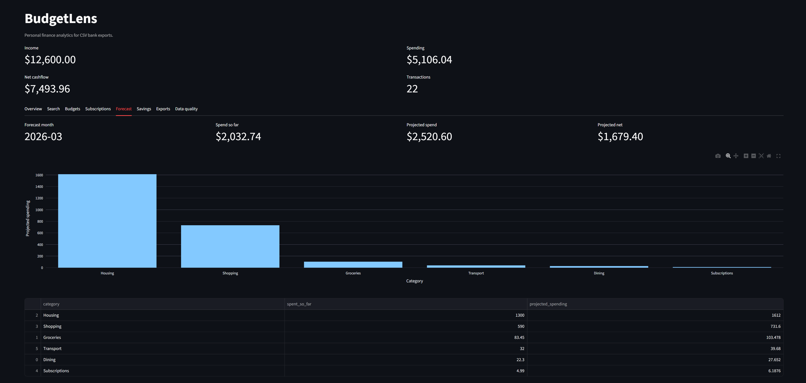
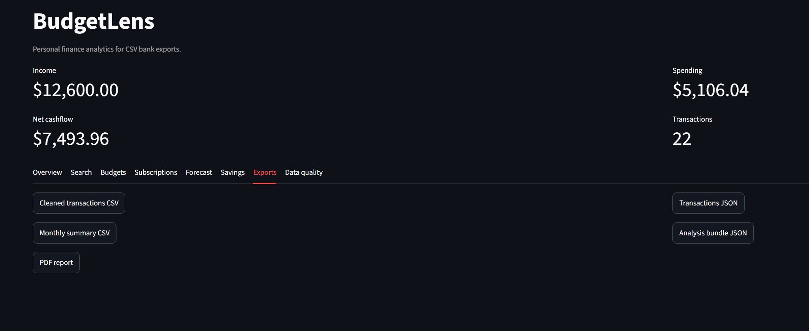

# BudgetLens

BudgetLens is an interactive Python dashboard for analyzing personal finance CSV exports. It normalizes messy bank files, categorizes transactions, detects unusual spending, tracks budgets, finds recurring payments, and exports clean reports.



## Why This Project Exists

Most bank exports are useful but annoying: inconsistent column names, different date formats, split debit and credit columns, unclear descriptions, and no quick way to understand spending patterns. BudgetLens turns those raw CSV files into a clean, portfolio-ready analytics product.

## Highlights

- CSV upload plus bundled demo datasets.
- Bank import presets for generic exports, PKO BP, mBank, ING, Revolut, Wise, and split debit/credit files.
- Automatic normalization of date, description, category, and amount columns.
- Rule-based categorization with custom keyword rules.
- Search and filters for text, date, category, and amount.
- Monthly budget tracking with over-budget warnings.
- Recurring payment and subscription detection.
- Month-end spending forecast.
- Savings dashboard with savings rate, best month, and worst month.
- Unusual expense detection.
- Presentation privacy mode for masked merchant names and rounded amounts.
- CSV, JSON, and PDF exports.
- Unit tests and GitHub Actions CI.

## Screenshots

### Transaction Search



### Budget Tracking



### Spending Forecast



### Export Center



## Tech Stack

| Area | Tools |
| --- | --- |
| App UI | Streamlit |
| Data processing | pandas |
| Charts | Plotly |
| Testing | pytest |
| CI | GitHub Actions |
| Deployment target | Streamlit Community Cloud |

## Project Structure

```text
budgetlens/
  app.py
  assets/
    screenshots/
  data/
    demo_transactions.csv
    sample_*.csv
  src/
    budgetlens/
      analytics.py
      budgets.py
      categorizer.py
      cleaner.py
      exports.py
      forecast.py
      formats.py
      io.py
      privacy.py
      reports.py
      subscriptions.py
  tests/
  .github/workflows/tests.yml
  requirements.txt
  pyproject.toml
```

## Sample Data

The `data/` folder includes several CSV files for testing different scenarios:

- `demo_transactions.csv` - baseline dataset used by default.
- `sample_student_life.csv` - smaller student-style budget.
- `sample_freelancer_cashflow.csv` - irregular freelance income and expenses.
- `sample_bank_export_alt_columns.csv` - alternative bank column names.
- `sample_european_format.csv` - comma decimal amounts.
- `sample_anomaly_heavy.csv` - intentionally large expenses for anomaly detection.

## Run Locally

```bash
python -m venv .venv
.venv\Scripts\activate
pip install -r requirements.txt
streamlit run app.py
```

Then open:

```text
http://localhost:8501
```

## Run Tests

```bash
pytest
```

Current local status:

```text
17 passed
```

## Deployment

This app is designed for Streamlit Community Cloud.

1. Push this repository to GitHub.
2. Go to Streamlit Community Cloud.
3. Create a new app from the GitHub repository.
4. Set the entry point to `app.py`.
5. Deploy.

After deployment, add the live URL here:

```text
Live demo: pending deployment
```

## What This Demonstrates

BudgetLens is designed as a portfolio project that shows practical Python skills beyond a basic dashboard:

- working with messy real-world CSV data,
- building reusable data-cleaning modules,
- separating business logic from UI code,
- writing tests for analytics behavior,
- designing a user-facing data product,
- preparing a project for CI and cloud deployment.

## Roadmap

- Add editable category corrections saved to a local file.
- Add optional machine-learning categorization after enough corrections.
- Add multi-currency support.
- Add richer PDF layout with charts.
- Add authentication if the app is adapted for personal use.

## License

MIT License.